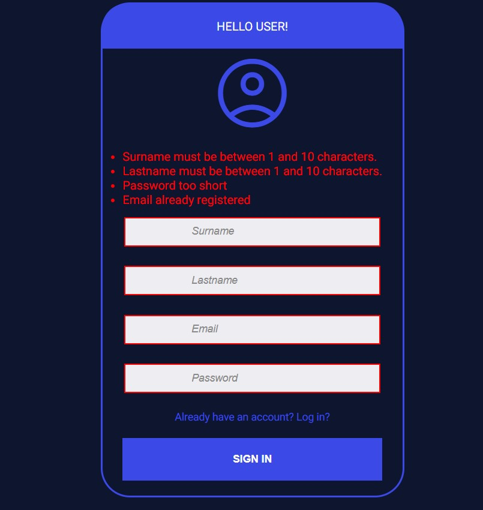
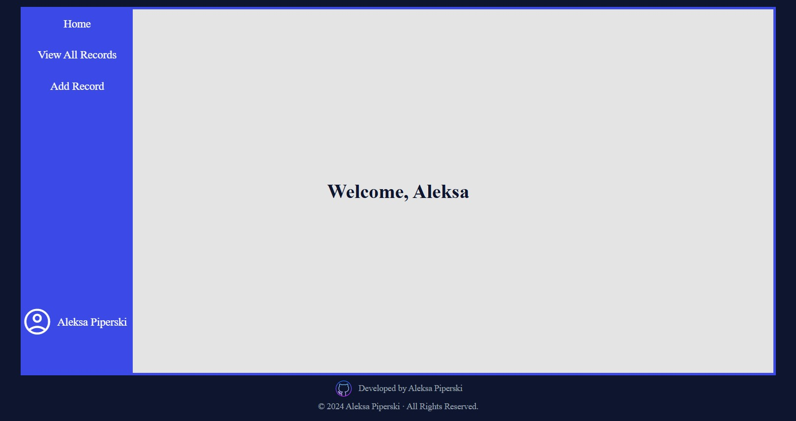
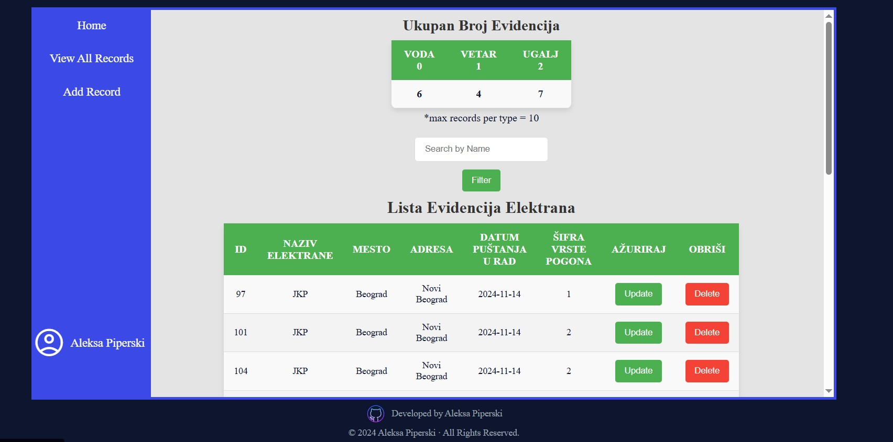

# Node.js Express PostgreSQL CRUD App with EJS Views, Passport Authentication, Multer File Upload, Nodemailer & OTP Verification
A refactored full-stack web application originally built in 2024, now rebuilt ( 2025 ) to use **EJS templating** for server-side rendering, simplified data handling, switched from JWT to Passport for session-based authentication, and removal of unnecessary frontend fetch calls. <br>
**Passport.js session-based authentication with bcrypt password hashing**, **MVC architecture**, and an **automated database setup script** for easy initialization.

## Table of Contents

- [Features](#-features)
- [Technologies](#-technologies)
- [Getting Started](#getting-started)
- [API Endpoints](#api-endpoints)
- [Database: energetika](#database-energetika)
- [Middleware](#middleware)
- [Screenshots](#screenshots)
- [Future Improvements](#-future-improvements)

---

## 🚀 Features

[⬆ Back to Table of Contents](#table-of-contents)

- **Full CRUD Functionality** - create, read, update, and delete records directly through EJS-rendered views

- **User Authentication via Passport.js** - session-based authentication with bcrypt password hashing

- **Per-User Data Views** - each user only sees records they created; all records are linked to the user's profile

- **Server-Side Rendering (EJS)** - real-time data updates and dynamic pages based on logged-in user data

- **PostgreSQL Integration** - all data operations handled through RESTful-style controllers and models

- **Input Filtering** - filter and search records efficiently in the records view

- **Admin Dashboard** - manage users and their permissions through an intuitive admin interface

- **Centralized Error Handling** - consistent error responses across the app

- **MVC Architecture** - clean structure separating logic, views, and data access layers

- **Email Sending via Nodemailer** - used for sending verification emails, OTP codes, and reset password link

- **OTP Verification System** - 6-digit code sent to users during registration, with expiration, secure validation, and a custom multi-field OTP UI (auto-focus, delete navigation, paste support)

- **Forgot Password Flow** – secure password reset system using one-time reset links sent to user email, including token hashing, expiration handling, and password update validation.

- **Password Reset Tokens** – stored as hashed values in the database with expiration timestamps, ensuring safe and time-limited recovery access.

- **File Uploads** - handle user file uploads with Multer, storing files in a defined location and saving metadata in the database.

- **Responsive Design** - layout optimized for both desktop and mobile

## 🧩 Technologies

[⬆ Back to Table of Contents](#table-of-contents)

- **EJS** - server-side templating for dynamic HTML rendering
- **CSS** - styling language
- **JavaScript (ES6)** - core language for backend logic and interactivity
- **Node.js** - JavaScript runtime environment
- **Express.js** - minimalist web framework for Node.js
- **PostgreSQL** - relational database for data persistence
- **pg** - official PostgreSQL client for Node.js

## Getting Started

[⬆ Back to Table of Contents](#table-of-contents)

### Prerequisites

Ensure you have these installed:

- [Node.js](https://nodejs.org/) (version 14+)
- [PostgreSQL](https://www.postgresql.org/) (version 12+)

### Installation

1. Clone the repository:

   ```bash
   git clone https://github.com/Piperski13/node-fullstack-postgres

   ```

2. Navigate into the project directory:

   ```bash
   cd node-fullstack-postgres
   ```

3. Install dependencies:

   ```bash
   npm install
   ```

4. Set up environment variables:

   Create a `.env` file in the root directory and add your PostgreSQL credentials

   ```plaintext
   PORT=
   DB_USER=
   DB_HOST=
   DB_DATABASE=
   DB_PASSWORD=
   DB_PORT=
   JWT_SECRET=
   DB_CONNECTION_STRING=
   
   ADMIN_EMAIL=
   ADMIN_PASSWORD=
   ADMIN_SURNAME=
   ADMIN_LASTNAME=
   
   EMAIL_USER=
   EMAIL_PASS=
   EMAIL_FROM=

   RESET_LINK_HOST=

   UPLOADS_PATH=
   UPLOADS_URL=
   ```

### Database Setup

1. To automatically create and populate your PostgreSQL database, run:

   ```bash
   node db/populatedb.js
   ```

   This script will generate the required tables and seed example data.
   <br>Note: You will need to create DB itself manualy inside of a psql:

   ```bash
   CREATE DATABASE DB_DATABASE;
   ```

### Running the app

1. Start the server:

   ```bash
   npm start
   ```

2. The server will start on `http://localhost:3000` by default.

# API Endpoints

[⬆ Back to Table of Contents](#table-of-contents)

## Login router ('/')

---

| Method | Endpoint  | Description                                                                                        |
| ------ | --------- | -------------------------------------------------------------------------------------------------- |
| GET    | `/`       | Renders the login page                                                                             |
| POST   | `/login`  | Authenticates the user using Passport.js, establishes a session, and redirects to the welcome page |
| GET    | `/logout` | Ends the user session and redirects to the login page                                              |

## OTP router ('/otp')

---

| Method | Endpoint  | Description                                                                                                  |
| ------ | --------- | ------------------------------------------------------------------------------------------------------------ |
| GET    | `/sign-in`      | Renders the sign-in page where users start the registration process                                    |
| POST   | `/generate-otp` | Validates user input, generates a 6-digit OTP, stores it, sends it via Nodemailer, then shows OTP page |
| POST   | `/verify-otp`   | Verifies the submitted OTP and, if valid, creates the user account and redirects to the login page     |

## View router ('/viewPage')

---

| Method | Endpoint           | Description                                                                                  |
| ------ | ------------------ | -------------------------------------------------------------------------------------------- |
| GET    | `/welcome`         | Renders the welcome page and passes the logged-in user object                                |
| GET    | `/recordsViewPage` | Renders the records view page, displaying only the logged-in user's data with filter options |
| GET    | `/addRecord`       | Renders the page for adding a new record                                                     |
| GET    | `/addRecord/:id`   | Renders the update record page with pre-filled data for the selected record                  |
| GET    | `/users`           | Renders the users page for admins, displaying all registered users                           |
| GET    | `/updateUser/:id`  | Renders the update user page with pre-filled data for editing user details                   |

## Record router ('/records')

---

| Method | Endpoint      | Description                                                                             |
| ------ | ------------- | --------------------------------------------------------------------------------------- |
| POST   | `/create/`    | Creates a new record linked to the logged-in user                                       |
| POST   | `/update/:id` | Updates an existing record that it belongs to the logged-in user, supports file uploads |
| GET    | `/delete/:id` | Deletes a record that it belongs to the logged-in user                                  |
| POST   | /delete-file/:fileId | Deletes a specific file associated with a record                                 |

## Users router ('/users')

---

| Method | Endpoint         | Description                                             |
| ------ | ---------------- | ------------------------------------------------------- |
| POST   | `/update/:id`    | Updates the selected user's information                 |
| POST   | `/delete/:id`    | Deletes the selected user from the system               |


## Password Reset Router (`/forgot`)

---

| Method | Endpoint                     | Description                                            |
| ------ | -----------------------------| ------------------------------------------------------ |
| GET    | `/password`                  | Displays the "Forgot Password" page                    |
| POST   | `/password`                  | Sends password reset email with secure token           |
| GET    | `/reset-password/:token`     | Shows the password reset form for a valid token        |
| POST   | `/reset-password/:token`     | Validates user input and updates the password          |


# Database: energetika

[⬆ Back to Table of Contents](#table-of-contents)

## Table: EvidencijaElektrane ( evidencijaelektrana )

The `evidencijaelektrana` table stores information about power plants.

### Attributes:

| Column Name       | Data Type              | Constraints           | Description                                                   |
| ----------------- | ---------------------- | --------------------- | ------------------------------------------------------------- |
| id                | integer                | NOT NULL, PRIMARY KEY | Unique identifier for each record                             |
| nazivelektrane    | character varying(100) | NOT NULL              | Name of the power plant                                       |
| mesto             | character varying(100) | NOT NULL              | Location of the power plant                                   |
| adresa            | character varying(50)  | NOT NULL              | Address of the power plant                                    |
| datumpustanjaurad | date                   | NOT NULL              | Date the power plant was put into operation                   |
| sifravrstepogona  | integer                | NOT NULL              | Foreign key referencing VrstaPogona table                     |
| user_id           | integer                | NOT NULL              | Foreign key referencing Korisnici table (owner of the record) |

### Foreign Key Constraints:

- **fk_pripada**:
  - **Column**: `sifravrstepogona`
  - **References**: `VrstaPogona(sifra)`
  - **Actions**:
    - ON UPDATE CASCADE
    - ON DELETE RESTRICT

- **fk_user**:
  - **Column**: `user_id`
  - **References**: `Korisnici(id)`
  - **Actions**:
    - ON UPDATE CASCADE
    - ON DELETE CASCADE


## Table: VrstaPogona ( vrstapogona )

The `vrstapogona` table stores information about type power plants as well as the total number of active power plants.
This table is 'support-table' for our main table evidencijaelektrana

### Attributes:

| Column Name         | Data Type              | Constraints           | Description                            |
| ------------------- | ---------------------- | --------------------- | -------------------------------------- |
| sifra               | integer                | NOT NULL, PRIMARY KEY | Unique identifier for each power-plant |
| naziv               | character varying(100) | NOT NULL              | Name of the power plant                |
| ukupanbrojelektrana | character varying(100) | NOT NULL              | Total number of power-plants           |

- The values are predefined and user has option of choosing from the dropdown element for these three types of power plants while trying to create a Record of power plant :

INSERT INTO "VrstaPogona" (Sifra, Naziv, UkupanBrojElektrana) VALUES ('0', 'Voda', 0);<br>
INSERT INTO "VrstaPogona" (Sifra, Naziv, UkupanBrojElektrana) VALUES ('1', 'Vetar', 0);<br>
INSERT INTO "VrstaPogona" (Sifra, Naziv, UkupanBrojElektrana) VALUES ('2', 'Ugalj', 0);<br>

## Table: korisnici ( korisnici )

The `korisnici` table stores information about users of the application

### Attributes:

| Column Name | Data Type              | Constraints          | Description                            |
| ----------- | ---------------------- | -------------------- | -------------------------------------- |
| id          | integer                | PRIMARY KEY          | Unique identifier of the user          |
| email       | character varying(100) | NOT NULL, UNIQUE     | User's email address                   |
| password    | character varying(100) | NOT NULL             | Hashed password using bcrypt           |
| surname     | character varying(50)  | NOT NULL             | User's first name                      |
| lastname    | character varying(50)  | NOT NULL             | User's last name                       |
| is_admin    | boolean                | DEFAULT FALSE        | Indicates whether the user is an admin |

- The `password` field is stored as a **hashed value using bcrypt**, so **plaintext passwords are never stored**.  
- Because of this, you **cannot create users directly using SQL shell** with plain-text passwords.  
- Users must be created via the **Sign In / Register form** (`/sign-in`), which automatically hashes the password before storing it in the database. 
- The `is_admin` field determines if a user has **administrative privileges** — administrators can access and manage all users and records.

## Table: otps ( otps )

The `otps` table stores temporary one-time passwords used during the account verification process before a user is fully registered.

### Attributes:

| Column Name | Data Type       | Constraints                | Description                                                           |
|-------------|-----------------|----------------------------|-----------------------------------------------------------------------|
| id          | SERIAL          | PRIMARY KEY                | Unique identifier for each OTP entry                                  |
| email       | VARCHAR(255)    | NOT NULL                   | Email address the OTP was generated for                               |
| otp         | VARCHAR(255)    | NOT NULL                   | **Hashed** OTP value (the 6-digit code is never stored in plain text) |
| created_at  | TIMESTAMP       | DEFAULT CURRENT_TIMESTAMP  | Timestamp indicating when the OTP was generated                       |

- OTPs are **hashed** before being saved to ensure secure temporary verification.  
- This table is used only during **sign-up verification**; once the user confirms the OTP, the user is created and the OTP entry becomes unnecessary.  
- An index on `email` improves lookup speed when verifying user-submitted OTP codes.

## Table: password_resets ( password_resets )

The password_resets table stores secure password-reset tokens generated when a user initiates a password recovery process.

### Attributes:

| Column Name | Data Type    | Constraints               | Description                                                      |
| ----------- | ------------ | ------------------------- | ---------------------------------------------------------------- |
| id          | SERIAL       | PRIMARY KEY               | Unique identifier for each password reset entry                  |
| email       | VARCHAR(255) | NOT NULL, UNIQUE          | Email address associated with the password reset request         |
| token       | VARCHAR(255) | NOT NULL                  | **Hashed** reset token (raw token is never stored in plain text) |
| expires_at  | TIMESTAMP    | NOT NULL                  | Exact time when the reset token expires and becomes invalid      |
| created_at  | TIMESTAMP    | DEFAULT CURRENT_TIMESTAMP | Timestamp indicating when the reset entry was created            |

- Tokens are always hashed before being stored, ensuring secure password recovery.
- Each email can only have one active reset token, enforced via the UNIQUE(email) constraint.
- expires_at ensures old or leaked tokens cannot be reused.
- An index (idx_password_resets_email) speeds up lookups during reset validation.

## Table: files (Files)

The `files` table stores information about files uploaded by users and linked to specific records.

### Attributes:

| Column Name   | Data Type | Constraints                       | Description                                                      |
| ------------- | --------- | --------------------------------- | ---------------------------------------------------------------- |
| id            | integer   | PRIMARY KEY                       | Unique identifier of the file                                    |
| user_id       | integer   | REFERENCES Korisnici(id) ON DELETE CASCADE | ID of the user who uploaded the file                    |
| record_id     | integer   | REFERENCES EvidencijaElektrana(id) ON DELETE CASCADE | ID of the record this file is associated with |
| filename      | text      | NOT NULL                          | Stored filename on the server                                    |
| original_name | text      | NOT NULL                          | Original name of the uploaded file                               |
| path          | text      | NOT NULL                          | File path or storage location                                    |
| mimetype      | text      | NOT NULL                          | MIME type of the file (e.g., image/png, application/pdf)         |
| size          | integer   | NOT NULL                          | File size in bytes                                               |
| created_at    | timestamp | DEFAULT NOW()                     | Timestamp when the file was uploaded                             |

- Files are linked to both a **user** and a **record**, and are automatically deleted if either the user or the record is removed (`ON DELETE CASCADE`).  
- `filename` stores the actual file name on disk, while `original_name` preserves the name from the user upload.  
- The `path` column defines where the file is stored, which can be a **local directory or configured storage location**.  
- `mimetype` and `size` provide **metadata** for validation and display purposes.


# Middleware

[⬆ Back to Table of Contents](#table-of-contents)

This project currently includes one custom middleware function:

- **isAuthenticated**:  
  This middleware checks if the user is logged in using Passport.js.  
  It ensures that only authenticated users can access protected routes.  
  If the user is not authenticated, they are redirected to the login page.
  This middleware is applied globally to all `/viewPage` and `/records` routes to protect access from unauthorized users.

- **upload.array("myFile", 3)**:  
  This middleware handles file uploads using Multer.  
  It allows users to upload up to 3 files per request and makes them available in `req.files` for further processing (e.g., saving metadata in the database or storing files on disk).

---

## Screenshots

[⬆ Back to Table of Contents](#table-of-contents)
<br>
<br>
## 🔐 Login & Sign-In Flow

This section showcases the full authentication entry flow — from standard login, through the sign-in (registration) process, including validation and loading states.

### **1. Login Page**
| |
|------------|
| 

### **2. Registration (Sign-In) Process**
| Sign-in Page | Sign-in Validation |  Sign-in Spinner |
|------------|-------------|-------------|
|  |  | 

## 🔐 OTP Verification Flow

This section shows the complete One-Time Password (OTP) verification process — from receiving the email to successfully activating the account.

### **OTP Input & Email Delivery**
|  OTP Page | Sent Email - Unopened |  Sent Email - Opened |
|------------|-------------|-------------|
|  |  | 


### **Successful Verification**
|  Login Page - OTP verification sucessfull |
|------------|
| 

## 🔑 Forgot Password & Security Flow

This section demonstrates the forgot password process, email delivery, password reset, and password security.

### **1. Requesting a Password Reset**
|  Forgot password | Forgot password - loader |  Forgot password - Sucesses |
|------------|-------------|-------------|
|  |  | 

### **2. Email Delivery**
|  Forgot password - Email | Forgot password - Email opened | Reset password - Page|
|------------|-------------|-------------|
|  |  | 

### **3. Password Successfully Updated**
|  Login Page - Password change sucessfull |
|------------|
| 

### **4. Password Security**
| Hashed Passwords |
| ---------- |
| 

## 📝 Main App Pages & Records Management

This section showcases the core application pages and CRUD functionality for records.

### **1. Welcome Pages**
| Welcome Page |
| ------------ |
| 

### **2. Viewing Records**
| View Records Page |
| ----------------- |
| 

### **3. Adding Records**
| Add Record Page | Add Record Page Validation |
|---------------|-------------|
|  | 

### **4. Updating Records**
| Update Record Page |
| ------------------ |
| 

## 🛠️ Admin Profile & User Management

This section showcases the admin capabilities, including viewing all records, managing users, and updating user profiles.

### **1. Admin Welcome Page**
| Welcome Page Admin |
| ------------ |
| 

### **2. User Management**
| Admin Users Page |
| ------------------ |
| 

### **3. Updating User Profiles**
| Admin User Update Page |
| ------------------ |
| 

## ⚡ Miscellaneous Pages & Actions

This section covers miscellaneous pages and UI elements that improve user experience, including error handling and session actions.

### **1. Error Handling**
| 404 Page - Displayed when a user accesses a non-existent route |
| ------------------ |
| 

### **2. Authenticated User Restrictions**
| Rendered when an authenticated user tries to access the login/sign in page |
| ------------------ |
| 

### **3. Logout Action**
| Logout Button |
| ------------- |
| 

---

## 🚀 Future Improvements

[⬆ Back to Table of Contents](#table-of-contents)
- **Deployment** - Host the application online after implementing all planned features.
- **File Uploads** - Allow users to attach images or documents to records, stored on disk or cloud (e.g., Cloudinary or S3).
- **Security Enhancements** - Add rate limiting, helmet middleware, and sanitize inputs against SQL/XSS attacks.
- **API Layer (REST or GraphQL)** - Expose your data via a JSON API for future frontend integrations.
